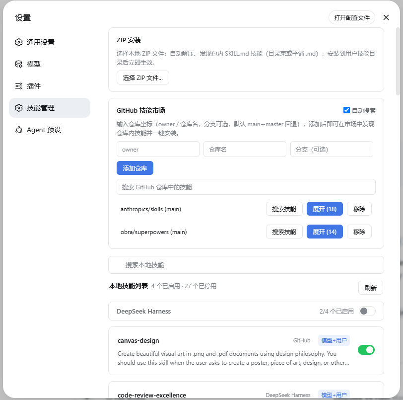

# dsh-skill-manager

[English](README.en.md) · [中文](README.md)

> One panel to manage every skill across DSH, Codex and Claude — hot-toggle, discover & install from GitHub skill marketplaces, or import from a local ZIP, all live without restart.



## What is this

A skill management plugin for DSH (DeepSeek Harness). Skill files live in many places: DSH's own skill directory, Codex's `~/.codex/skills`, Claude's `~/.claude/skills`, and skill repositories on GitHub. This plugin adds a "Skill Manager" section to the Settings page, bringing all these sources into one panel for unified viewing and management.

Featured in the GitHub [`dsh-plugin`](https://github.com/topics/dsh-plugin) topic.

## Features

- **Skill list**: merges registry (enabled) and disk (disabled) entries, grouped by source (DeepSeek Harness / Agents / Project / Codex / Claude), showing name, description, source, invocation policy and enabled state; skills installed from GitHub carry a source label.
- **Toggle**: toggling DSH / Agents skills renames `SKILL.md` ↔ `SKILL.md.disabled`; the filesystem watcher picks it up in ~200ms, and DSH, Codex and Claude all follow this convention. Skills in codex / claude directories are disabled by default and only enter the official `/skills` registry after explicit enablement.
- **Directory-level toggle**: the switch on a group header toggles the whole source directory at once.
- **ZIP install**: pick a local `.zip` (≤64 MiB); it is extracted, skills inside are discovered automatically (SKILL.md bundles or flat `.md`), deduplicated, installed into `~/.dsh/skills` and enabled; an archive without skills is rejected with an error.
- **GitHub skill search**: add a repository (owner / name / branch; branch is optional and falls back to main→master), then search skills across all added repositories by keyword and install them individually; a separate search box filters locally installed skills.
- **Refresh after install**: the list refreshes automatically after ZIP / repo installs, with a manual refresh button next to the title; click a card to expand the full skill content.

## File layout

| File | Role |
|---|---|
| `lib/index.js` | host side: `skillManager` remote service (list / content / setEnabled / installZip / repo APIs) |
| `lib/skill-files.js` | disk conventions: root scanning, frontmatter parsing, `.disabled` toggling |
| `lib/skill-zip.js` | ZIP parsing/extraction (store+deflate), CRC32 checks, entry-name safety checks, in-archive skill discovery and install |
| `lib/skill-repo.js` | GitHub archive downloads (size cap / timeout / retry / cache / mirror base), repo skill scanning, per-directory install |
| `lib/client.js` | browser side: hand-written bundle registering the `settings.section` slot (id: `skill-manager`, order: 17) |

## Install

```powershell
dsh plugin --profile web add .   # run inside the plugin directory
```

Restart DSH Web after code changes (the host manifest is registered at gateway startup; new endpoints 404 until then).

On Windows the plugin depends on `zod` and `@deepseek-ai/dsh-typert-protocol`, which ship with the DSH install tree. The plugin's `node_modules` is a junction pointing at `<dsh install dir>/node_modules`. Recreate it if removed:

```powershell
New-Item -ItemType Junction -Path "node_modules" -Target "C:\Users\<you>\AppData\Roaming\npm\node_modules\@deepseek-ai\dsh\node_modules"
```

## Tests

Built on Node's `node:test` with no extra dependencies — 100 test cases:

```powershell
npm test
```

Coverage: `skill-zip` (parsing/extraction/safety checks/discovery/conflicts/corrupt archives), `skill-repo` (ref validation/branch fallback/cache/retry/install), `index` (host remote methods + state persistence), `client` (bundle loading/descriptors/face round-trips).

## Limitations

- Skills from bundled / runtime sources have no disk files and cannot be edited; their toggles are disabled.
- Disabling only renames files; content is never deleted and can always be restored.
- Without an open session only user-level and global skills are shown (project-level skills depend on the session cwd).
- Not yet implemented: zip-bomb budgets, symlink materialization, ZIP64, download proxy support.
